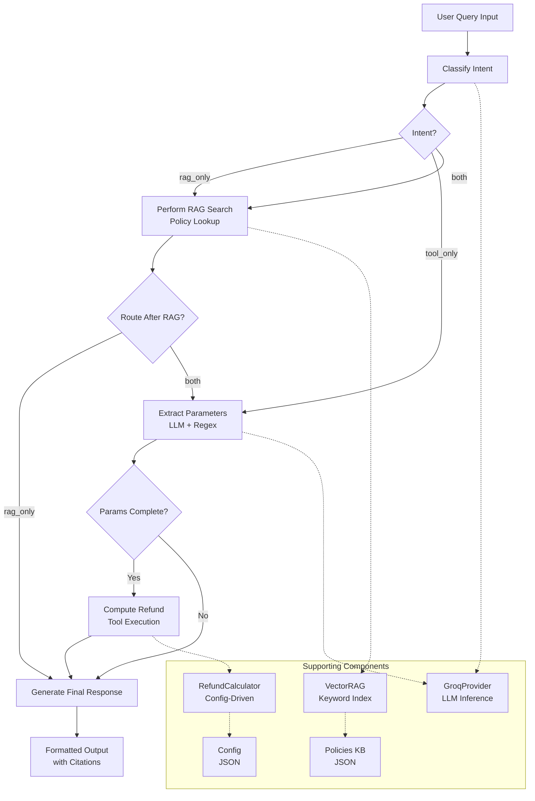

# LLM Powered RAG with Tool Calling Agent

## 1. Executive Summary

This report outlines the architecture and implementation of an AI-powered customer support agent designed to handle returns and warranty inquiries. The system combines **Retrieval-Augmented Generation (RAG)** for policy lookup with a deterministic **refund calculation tool** in a structured **LangGraph** agent framework. Powered by Groq's high-speed LLM inference, the agent classifies intent, retrieves policies, extracts parameters, computes refunds, and generates coherent, citation-backed responses. The solution meets all acceptance criteria, delivering accurate, deterministic, and user-friendly support.

---

## 2. System Architecture & Workflow

The system follows a state-machine paradigm managed by LangGraph. The state object (`AgentState`) is progressively enriched as it moves through specialized nodes. The flow is conditional rather than strictly linear, allowing dynamic routing of queries.

### 2.1 High-Level Architectural Diagram

## 2.2 Component Interaction

- **Streamlit Frontend (`main.py`)** – User interface, chat history, and agent invocation.  
- **LangGraph Agent (`base_agent.py`, `graph_builder.py`)** – Core logic. `GraphBuilder` builds the state machine; `LLMEnhancedReturnsAgent` defines node methods.  
- **Models Layer (`llm_providers.py`, `vector_rag.py`)** – AI functionality. `GroqProvider` abstracts LLM calls; `VectorRAG` performs semantic policy search.  
- **Tools Layer (`refund_calculator.py`)** – Deterministic `compute_refund` function applying business rules.  
- **Data Layer (`policies.json`, `config.json`)** – Static files containing policies and rules, editable without code changes.  
- **Utilities (`helpers.py`)** – JSON loading and regex-based parameter extraction.  

---

## 3. Technology Stack & Frameworks

| Layer              | Technology           | Purpose                                       |
| ------------------ | -------------------- | --------------------------------------------- |
| **Frontend**       | Streamlit            | Rapid UI development in Python.               |
| **Core Framework** | LangGraph            | Robust, stateful, multi-step agent framework. |
| **LLM Provider**   | Groq API             | Ultra-low latency inference for LLMs.         |
| **Language Model** | Llama-3-70B-8192     | Strong reasoning and instruction following.   |
| **Language SDK**   | langchain-core       | Standardized LLM abstractions.                |
| **Development**    | Python 3.10+, Pydantic/TypedDict | Type safety and validation. |
| **Configuration**  | JSON                 | Human-readable format for policies and rules. |

---

## 4. Core Functionality

### 4.1 Intent Classification & Routing
The LLM first classifies intent:
- **`rag_only`** – Policy questions without item details.  
- **`tool_only`** – Queries with all required parameters.  
- **`both`** – Partial details requiring both policy lookup and refund calculation.  

---

### 4.2 Knowledge Retrieval (RAG)
`VectorRAG` performs keyword-based search with LLM-enhanced query understanding:
1. **Indexing** – Keywords built from `policies.json`.  
2. **Search** – Queries matched against policy titles and content.  
3. **Category Boosting** – Category keywords increase relevance.  
4. **LLM Enhancement** – Improves results for low-confidence matches.  

**Output**: Ranked policy snippets, cited in responses.  

---

### 4.3 Parameter Extraction
Two-tiered method:
1. **Primary (LLM)** – Extracts `price`, `days_since_delivery`, `opened`, `category`.  
2. **Fallback (Regex)** – Captures parameters if LLM parsing fails.  

Missing values are recorded, and clarifying questions are asked if needed.  

---

### 4.4 Refund Calculation
The `RefundCalculator` applies deterministic rules:
1. Look up return window.  
2. If exceeded → refund = **$0**.  
3. Otherwise, apply category/condition-specific restocking fee.  
4. Refund = `price - (price * fee)`.  

**Output**: Refund amount, applied rules, and notes.  

---

### 4.5 Response Generation
Final step synthesizes output:
- If parameters missing → concise clarifying question.  
- If RAG used → cite policy in plain language.  
- If tool used → state refund amount and rules.  
- Conclude with transparency: sources and applied methods.  

---

## 5. Acceptance Criteria Validation

Tested against eight required prompts:

| #  | Prompt                                             | Intent     | Path                            | Result                             |
| -- | ------------------------------------------------- | ---------- | ------------------------------- | ---------------------------------- |
| 1  | "What’s your return window for electronics?"       | rag_only  | RAG → Response                  | ✅ Correct policy cited             |
| 2  | "Do you charge a restocking fee for opened items?" | rag_only  | RAG → Response                  | ✅ Correct policy cited             |
| 3  | "$300 sealed blender, 10 days ago"                 | tool_only | Extract → Tool → Response       | ✅ Correct refund                   |
| 4  | "Headphones $200, opened, 12 days ago"             | tool_only | Extract → Tool → Response       | ✅ Correct refund                   |
| 5  | "jacket last week for $120"                        | both      | RAG → Extract → Tool → Response | ✅ Policy + refund correct          |
| 6  | "I’m past 35 days"                                 | both      | RAG → Extract → Response        | ✅ Correctly flagged as past window |
| 7  | "policy + estimate: sealed phone $900, 14 days"    | both      | RAG → Extract → Tool → Response | ✅ Policy + refund correct          |
| 8  | "no restocking fee for electronics?"               | rag_only  | RAG → Response                  | ✅ Contradicted with citation       |

**All criteria met**: Correct routing, handling of mixed intents, clarifications, citations, and deterministic refund tool usage.  

---

## 6. Images
---
- Interface

- Testing Queries (Backend)

- Testing UI
  

## 7. Conclusion

The **LLM Powered RAG with Tool Calling Agent** is a reliable, transparent solution for automating refunds and policy support.  

- Leverages **LangGraph** for stateful flows.  
- Separates **LLM reasoning** from **deterministic calculation**.  
- Uses a **hybrid RAG approach** for accurate results.  

